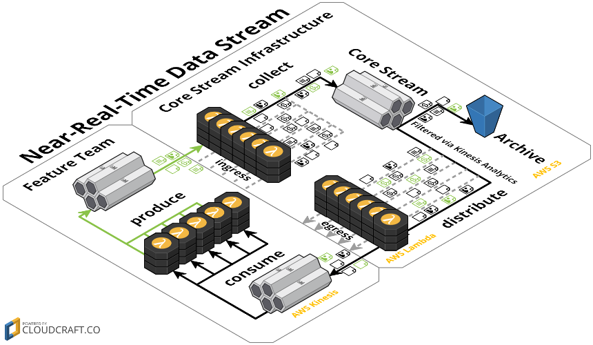

# Retail Stream

This retail stream defines and manages the primary stream through which all events flow.

This portion of the project will define and manage all ingress and egress (fan-out and fan-in) patterns for the publishing, validation, and distribution of events.

Defining the shape or contents of what goes through the retail stream is beyond the scope of concern for this portion of the project.

System Diagram:  


Reference:  
1. <a href='retail-stream-ingress.json'>Ingress Event Schema</a>  
2. <a href='#Example Ingress Object Template'>Example Ingress Object Template</a>  
3. <a href='#Example Ingress Object'>Example Ingress Object</a>  
4. <a href='retail-stream-egress.json'>Egress Event Schema</a>  
5. <a href='#Example Egress Object Template'>Example Egress Object Template</a>  
6. <a href='#Example Egress Object'>Example Egress Object</a>  

###Example Ingress Object Template
This is a template of the event format producers/publishers to the stream must provide.  
For details, please see the <a href='retail-stream-ingress.json'>Ingress Schema</a>.

```
{
  schema:       <string>      // see *1 below
  followsFrom:  <string>      // optional, see *2 below
  origin:       <string>      // see *3 below
  timeOrigin:   <date-time>   // local originator time stamp
  data: {                     // an arbitrary object with a schema declaration
    schema:     <url>,        // see *1 below (again)
    ...
  }
}

// *1
// please use good prefixes (i.e. com.company)
// please also use good categorization (i.e. rest url styled pathing) to allow smart filtering
// (i.e. so that 'com.company/product/*' could be used to select for all product related events)
// see http://json-schema.org/
// see http://jsonschema.net/

// *2
// an optional eventId for an event which is the direct precursor of this event
// these will be used to identify and calculate providence throughout the system
// As such traces and other useful analyses may be performed

// *3
// please supply a unique ID.
// we suggest that an ID that communicates the class of origins (e.g. merchant) and the
// unique ID of the actual merchant (e.g. with UUID '12345678-1234-4123-a123-123456789012')
```

###Example Ingress Object
```
{
  schema:      "com.company/retail-stream/1-0-0",
  followsFrom: "shardId-000000000000:12345678901234567890123456789012345678901234567890123456",
  origin:      "merchant/12345678-1234-4123-a123-123456789012",
  timeOrigin:  "1234-12-12T12:34:56.01Z",
  data: {
    schema:    "com.company/product/create/1-0-0"
    ...
  }
}
```

###Example Egress Object Template
This is a template of the event format consumers/processors of the stream will receive.
For details, please see the <a href='retail-stream-egress.json'>Egress Schema</a>.

```
{
  schema:       <url>       // [as above] see ingress comment *1
  followsFrom:  <string>    // [as above] optional, see ingress comment *2
  eventId:      <string>    // a unique ID for this specific event
  origin:       <string>    // [as above] see ingress comment *3
  timeOrigin:   <date-time> // [as above] local originator time stamp
  timeIngest:   <date-time> // time that the event was ingested into the core stream
  timeProcess:  <date-time> // time that the event was distributed from the core stream
  data: {                   // [as above] an arbitrary object with a schema declaration
    schema:     <url>,      // [as above] see ingress comment *1
    ...
  }
}
```

###Example Egress Object
```
{
  schema:       "com.company/retail-stream/1-0-0",
  followsFrom:  "shardId-000000000000:12345678901234567890123456789012345678901234567890123456",
  eventID:      "shardId-000000000001:12345678901234567890123456789012345678901234567890123456",
  origin:       "merchant/12345678-1234-4123-a123-123456789012",
  timeOrigin:   "1234-12-12T12:34:56.01Z",
  timeIngest:   "1234-12-12T12:34:56.01Z",
  timeProcess:  "1234-12-12T12:34:56.01Z",
  data: {
    schema:     "com.company/product/create/1-0-0"
    ...
  }
}
```
